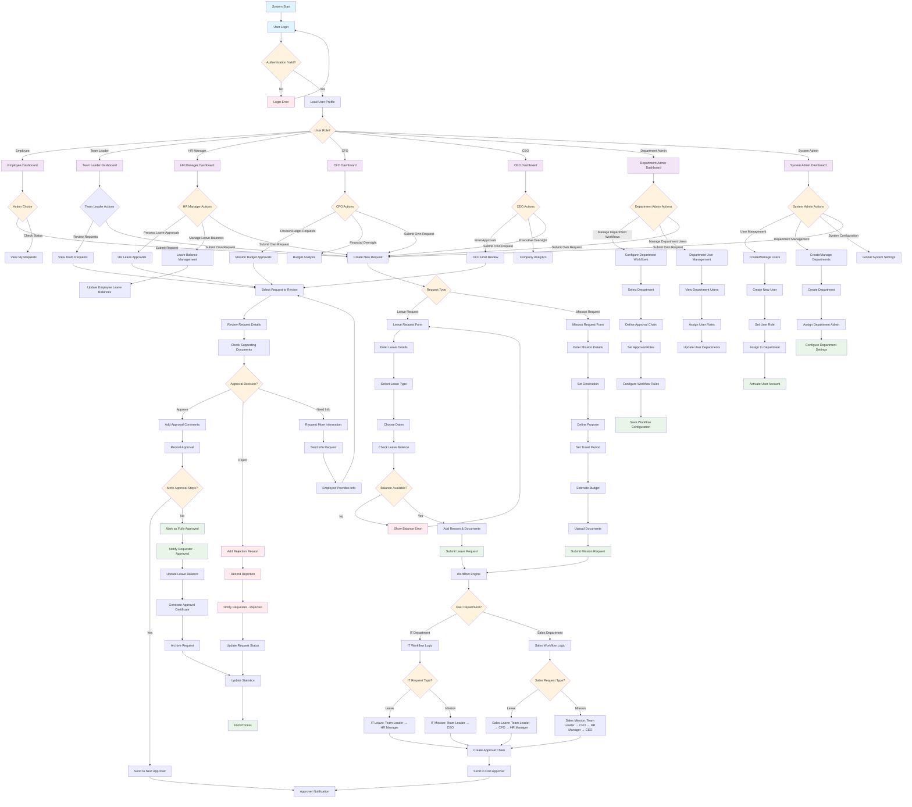

# Laravel Workflow Management System - Detailed Flowchart

## Complete System Flow Based on Requirements

## Key Features of This Flowchart

This flowchart accurately represents the Laravel Workflow Management System with:

1. **User Authentication & Role Assignment** - Multi-role authentication system with proper routing to role-specific dashboards
2. **Request Management** - Separate workflows for Leave and Mission requests with detailed form processes
3. **Department-Specific Workflows** - IT and Sales departments with their specific approval chains
4. **Multi-Level Approval Processes** - Sequential approval handling with different paths for each department and request type
5. **Role-Specific Functions** - Each role (Team Leader, HR Manager, CFO, CEO, Department Admin, System Admin) has specific actions they can perform
6. **Notification System** - Integrated notification process at each stage
7. **Final Processing** - Complete request closure with leave balance updates and certificate generation

The flowchart maintains the exact structure and styling from your original diagram while incorporating the specific requirements of the Laravel Workflow Management System as documented in the project files.
