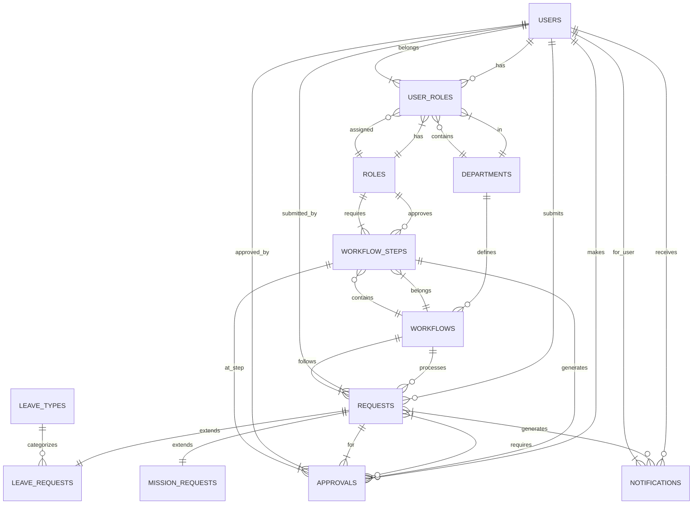
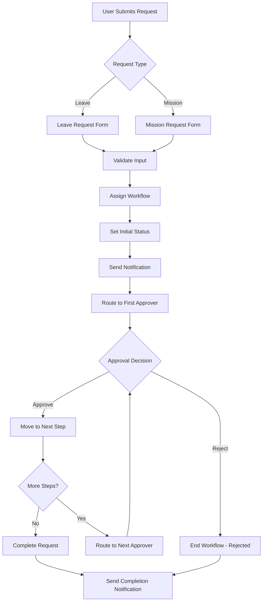
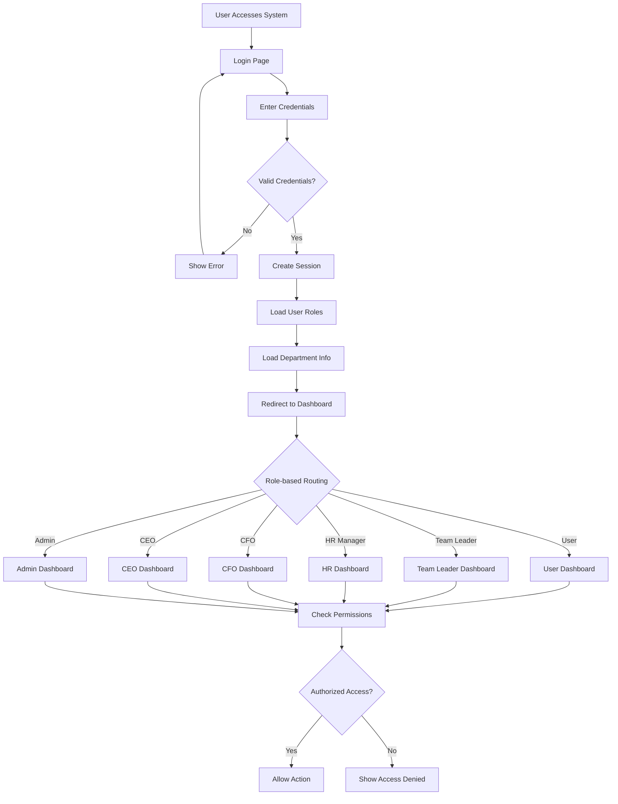
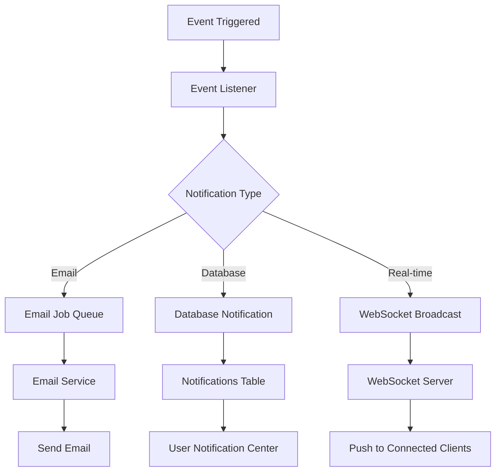
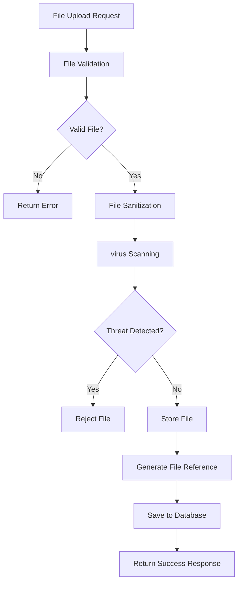

# Laravel Workflow Management System - System Architecture

## Overview

This document provides a visual representation of the system architecture for the Laravel Workflow Management System using Mermaid diagrams.

For a more detailed and comprehensive flowchart of the entire system, please refer to the [Workflow Flowchart](workflow_flowchart.md).

## System Components Architecture

```mermaid
graph TD
    A[Client Layer] --> B[Web Server]
    A --> C[API Layer]
    A --> D[Mobile App]

    B --> E[Laravel Application]
    C --> E
    D --> C

    E --> F[Authentication System]
    E --> G[Authorization System]
    E --> H[Workflow Engine]
    E --> I[Request Management]
    E --> J[User Management]
    E --> K[Dashboard & Reporting]

    F --> L[Login/Logout]
    F --> M[Registration]
    F --> N[Password Reset]

    G --> O[Role-based Access]
    G --> P[Department-based Access]
    G --> Q[Gates & Policies]

    H --> R[Workflow Definition]
    H --> S[Approval Process]
    H --> T[Workflow Execution]

    I --> U[Leave Requests]
    I --> V[Mission Requests]
    I --> W[Request Processing]

    J --> X[User Profiles]
    J --> Y[Role Assignment]
    J --> Z[Department Allocation]

    K --> AA[Statistics Dashboard]
    K --> AB[Reporting Engine]
    K --> AC[Analytics]

    E --> AD[Database Layer]
    AD --> AE[MySQL/PostgreSQL]

    E --> AF[File Storage]
    AF --> AG[Local Storage]
    AF --> AH[Cloud Storage]

    E --> AI[Cache Layer]
    AI --> AJ[Redis/Memcached]

    E --> AK[Queue System]
    AK --> AL[Background Jobs]
    AK --> AM[Notifications]

    E --> AN[Email System]
    AN --> AO[SMTP]
    AN --> AP[Email Templates]
```

## Database Schema Diagram

## Workflow Process Flow

## Authentication & Authorization Flow

## Notification System Architecture

## File Management System

