# Laravel Workflow Management System - Comprehensive Flowchart

## Complete System Flow

```mermaid
graph TD
    %% User Authentication & Role Assignment
    A[System Start] --> B[User Login]
    B --> C{Authentication Valid?}
    C -->|No| D[Login Error]
    C -->|Yes| E[Load User Profile]
    D --> B
    E --> F{User Role?}

    %% Role-based Dashboard Routing
    F -->|Employee| G[Employee Dashboard]
    F -->|Team Leader| H[Team Leader Dashboard]
    F -->|HR Manager| I[HR Manager Dashboard]
    F -->|CFO| J[CFO Dashboard]
    F -->|CEO| K[CEO Dashboard]
    F -->|Department Admin| L[Department Admin Dashboard]
    F -->|System Admin| M[System Admin Dashboard]

    %% Employee Functions
    G --> N{Action Choice}
    N -->|Submit Request| O[Create New Request]
    N -->|Check Status| P[View My Requests]

    %% Request Creation Process
    O --> Q{Request Type}
    Q -->|Leave Request| R[Leave Request Form]
    Q -->|Mission Request| S[Mission Request Form]

    R --> T[Enter Leave Details]
    T --> U[Select Leave Type]
    U --> V[Choose Dates]
    V --> W[Check Leave Balance]
    W --> X{Balance Available?}
    X -->|No| Y[Show Balance Error]
    X -->|Yes| Z[Add Reason & Documents]
    Y --> R
    Z --> AA[Submit Leave Request]

    S --> BB[Enter Mission Details]
    BB --> CC[Set Destination]
    CC --> DD[Define Purpose]
    DD --> EE[Set Travel Period]
    EE --> FF[Estimate Budget]
    FF --> GG[Upload Documents]
    GG --> HH[Submit Mission Request]

    %% Workflow Routing Engine
    AA --> II[Workflow Engine]
    HH --> II
    II --> JJ{User Department?}
    JJ -->|IT Department| KK[IT Workflow Logic]
    JJ -->|Sales Department| LL[Sales Workflow Logic]
    JJ -->|Other Departments| MM[Default Workflow Logic]

    %% IT Department Workflows
    KK --> NN{IT Request Type?}
    NN -->|Leave| OO[IT Leave: Team Leader → HR Manager]
    NN -->|Mission| PP[IT Mission: Team Leader → CEO]

    %% Sales Department Workflows
    LL --> QQ{Sales Request Type?}
    QQ -->|Leave| RR[Sales Leave: Team Leader → CFO → HR Manager]
    QQ -->|Mission| SS[Sales Mission: Team Leader → CFO → HR Manager → CEO]

    %% Other Department Workflows
    MM --> TT{Request Type?}
    TT -->|Leave| UU[Default Leave Workflow]
    TT -->|Mission| VV[Default Mission Workflow]

    %% Approval Process
    OO --> WW[Create Approval Chain]
    PP --> WW
    RR --> WW
    SS --> WW
    UU --> WW
    VV --> WW
    WW --> XX[Send to First Approver]
    XX --> YY[Approver Notification]

    %% Team Leader Dashboard Functions
    H --> ZZ{Team Leader Actions}
    ZZ -->|Review Requests| AAA[View Team Requests]
    ZZ -->|Submit Own Request| O

    %% Approval Decision Process
    AAA --> BBB[Select Request to Review]
    BBB --> CCC[Review Request Details]
    CCC --> DDD[Check Supporting Documents]
    DDD --> EEE{Approval Decision?}
    EEE -->|Approve| FFF[Add Approval Comments]
    EEE -->|Reject| GGG[Add Rejection Reason]
    EEE -->|Need Info| HHH[Request More Information]

    FFF --> III[Record Approval]
    GGG --> JJJ[Record Rejection]
    HHH --> KKK[Send Info Request]

    III --> LLL{More Approval Steps?}
    LLL -->|Yes| MMM[Send to Next Approver]
    LLL -->|No| NNN[Mark as Fully Approved]
    MMM --> YY

    JJJ --> OOO[Notify Requester - Rejected]
    NNN --> PPP[Notify Requester - Approved]
    KKK --> QQQ[Employee Provides Info]
    QQQ --> BBB

    %% HR Manager Functions
    I --> RRR{HR Manager Actions}
    RRR -->|Process Leave Approvals| SSS[HR Leave Approvals]
    RRR -->|Manage Leave Balances| TTT[Leave Balance Management]
    RRR -->|Submit Own Request| O

    SSS --> BBB
    TTT --> UUU[Update Employee Leave Balances]

    %% CFO Functions
    J --> VVV{CFO Actions}
    VVV -->|Review Budget Requests| WWW[Mission Budget Approvals]
    VVV -->|Financial Oversight| XXX[Budget Analysis]
    VVV -->|Submit Own Request| O

    WWW --> BBB

    %% CEO Functions
    K --> YYY{CEO Actions}
    YYY -->|Final Approvals| ZZZ[CEO Final Review]
    YYY -->|Executive Oversight| AAAA[Company Analytics]
    YYY -->|Submit Own Request| O

    ZZZ --> BBB

    %% Department Admin Functions
    L --> BBBB{Department Admin Actions}
    BBBB -->|Manage Department Workflows| CCCC[Configure Department Workflows]
    BBBB -->|Manage Department Users| DDDD[Department User Management]
    BBBB -->|Submit Own Request| O

    CCCC --> EEEE[Select Department]
    EEEE --> FFFF[Define Approval Chain]
    FFFF --> GGGG[Set Approval Roles]
    GGGG --> HHHH[Configure Workflow Rules]
    HHHH --> IIII[Save Workflow Configuration]

    DDDD --> JJJJ[View Department Users]
    JJJJ --> KKKK[Assign User Roles]
    KKKK --> LLLL[Update User Departments]

    %% System Admin Functions
    M --> MMMM{System Admin Actions}
    MMMM -->|User Management| NNNN[Create/Manage Users]
    MMMM -->|Department Management| OOOO[Create/Manage Departments]
    MMMM -->|System Configuration| PPPP[Global System Settings]
    MMMM -->|Submit Own Request| O

    NNNN --> QQQQ[Create New User]
    QQQQ --> RRRR[Set User Role]
    RRRR --> SSSS[Assign to Department]
    SSSS --> TTTT[Activate User Account]

    OOOO --> UUUU[Create Department]
    UUUU --> VVVV[Assign Department Admin]
    VVVV --> WWWW[Configure Department Settings]

    PPPP --> XXXX[System Configuration Options]

    %% Final Processing
    PPP --> YYYY[Update Leave Balance]
    YYYY --> ZZZZ[Generate Approval Certificate]
    ZZZZ --> AAAA[Archive Request]
    AAAA --> BBBB[Update Statistics]

    JJJ --> CCCCC[Update Request Status]
    CCCCC --> BBBB
    BBBB --> DDDDD[End Process]

    OOOO --> EEEEE[End Process]
    PPPP --> EEEEE
    IIII --> EEEEE
    TTTT --> EEEEE
    LLLL --> EEEEE
    WWWW --> EEEEE

    %% Individual Node Styling
    style A fill:#e1f5fe
    style B fill:#e1f5fe
    style G fill:#f3e5f5
    style H fill:#f3e5f5
    style I fill:#f3e5f5
    style J fill:#f3e5f5
    style K fill:#f3e5f5
    style L fill:#f3e5f5
    style M fill:#f3e5f5
    style AA fill:#e8f5e8
    style HH fill:#e8f5e8
    style NNN fill:#e8f5e8
    style PPP fill:#e8f5e8
    style IIII fill:#e8f5e8
    style TTTT fill:#e8f5e8
    style WWWW fill:#e8f5e8
    style DDDDD fill:#e8f5e8
    style EEEEE fill:#e8f5e8
    style C fill:#fff3e0
    style F fill:#fff3e0
    style N fill:#fff3e0
    style Q fill:#fff3e0
    style X fill:#fff3e0
    style JJ fill:#fff3e0
    style NN fill:#fff3e0
    style QQ fill:#fff3e0
    style TT fill:#fff3e0
    style EEE fill:#fff3e0
    style LLL fill:#fff3e0
    style RRR fill:#fff3e0
    style VVV fill:#fff3e0
    style YYY fill:#fff3e0
    style BBBB fill:#fff3e0
    style MMMM fill:#fff3e0
    style D fill:#ffebee
    style Y fill:#ffebee
    style GGG fill:#ffebee
    style JJJ fill:#ffebee
    style OOO fill:#ffebee
```

## Key System Components

### 1. Authentication & Authorization System

-   Multi-role authentication (Employee, Team Leader, HR Manager, CFO, CEO, Department Admin, System Admin)
-   Role-based permissions using Laravel Gates/Policies
-   Department-based user allocation

### 2. Request Management System

-   Leave request submission with calendar integration
-   Mission request submission with budget estimation
-   File attachment support for supporting documents
-   Leave type categorization (Annual, Sick, Emergency, etc.)
-   Leave balance tracking

### 3. Workflow Engine

-   Dynamic workflow creation and management
-   Department-specific approval workflows:
    -   IT Department: Team Leader → HR Manager (Leave) / Team Leader → CEO (Mission)
    -   Sales Department: Team Leader → CFO → HR Manager (Leave) / Team Leader → CFO → HR Manager → CEO (Mission)
    -   Other Departments: Configurable workflows
-   Sequential approval process handling
-   Status tracking (Pending, Approved, Rejected, In Progress)

### 4. Notification System

-   Real-time notifications for request status changes
-   Database-stored notifications
-   Notification center with read/unread status
-   Email notifications at each workflow stage

### 5. Dashboard & Reporting

-   Role-specific dashboards
-   Request statistics and analytics
-   Pending approvals overview
-   Workflow performance metrics
-   Export functionality (PDF/Excel reports)

## Data Flow Process

1. **User Authentication**: Users log in and are routed to role-specific dashboards
2. **Request Submission**: Users submit leave or mission requests with required details
3. **Workflow Assignment**: System assigns appropriate workflow based on department and request type
4. **Approval Routing**: Requests are routed through defined approval chains
5. **Decision Making**: Approvers review requests and make decisions
6. **Notification**: All stakeholders receive relevant notifications
7. **Final Processing**: Approved requests update leave balances and generate certificates

## Security Features

-   CSRF protection on all forms
-   SQL injection prevention using Eloquent ORM
-   File upload validation and scanning
-   Rate limiting on API endpoints
-   Secure password policies
-   Activity monitoring and suspicious behavior detection

This comprehensive flowchart represents the complete architecture and operational flow of the Laravel Workflow Management System, showing all key components, processes, and interactions as specified in the requirements.
